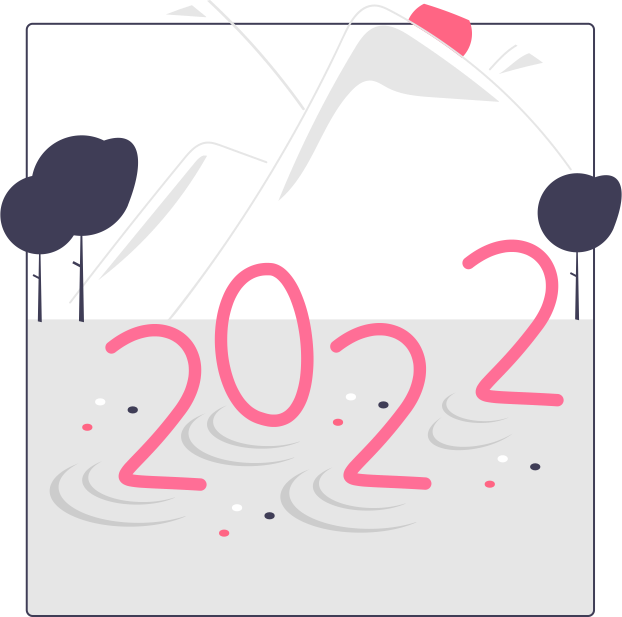

<h1 align="center">おはよう皆さん 
Ohayou Mina-san 🥷
</h1>

  <table>
    <tr>
      <td border="0px">
- 👨🏻‍🎓 Information Technology' student at Lambung Mangkurat University 
- 🌱 I’m currently don't know what to do 🍭 
- 📫 Reach out to me:  biahlilakbar1@gmail.com 
      </td>
      <td>
        
      </td>
    </tr>
  </table>

   
   

   
  <h2 align="center">Contact me</h2>

  
<a href="https://www.flaticon.com/stickers-pack/social-media-507" title="Social Media stickers" align="center"><h4>Contac me stickers created by Stickers - Flaticon</h4></a>
  
 

